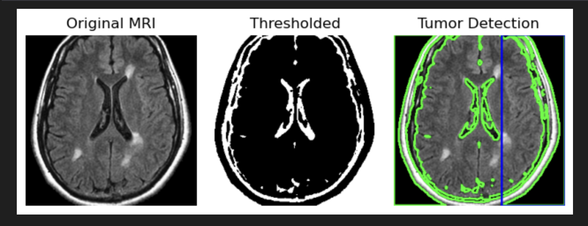

# 🧠 Brain Tumor Shape Detection using OpenCV

This project detects and highlights brain tumor shapes from MRI scans using **OpenCV**.  
It uses image processing techniques such as thresholding, contour detection, and morphological transformations to identify tumor regions in brain images.

---

## 📌 Features
- Load MRI brain images
- Preprocess images (grayscale, blur, thresholding)
- Detect tumor contours
- Draw bounding boxes or outlines around tumors
- Save processed images
- Simple & lightweight OpenCV implementation

---

## 📷 Example Output

Original MRI Image → Detected Tumor Shape

